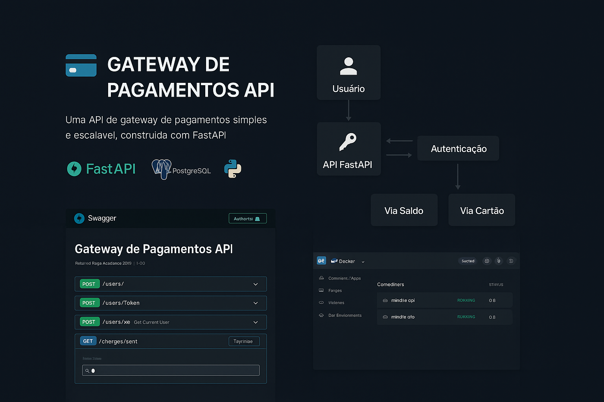

# 💳 Gateway de Pagamentos API

<p align="center">
  
</p>

> **Uma API de gateway de pagamentos** simples e escalável, construída com **FastAPI**, que permite:
> - Criar usuários com saldo inicial 💰  
> - Gerenciar cobranças pendentes e pagas 📄  
> - Processar pagamentos via saldo ou cartão de crédito simulado 💳  

## ✨ Funcionalidades

✅ **Autenticação JWT** — Segurança com tokens de acesso  
✅ **Gerenciamento de Usuários** — Cadastro, saldo inicial e autenticação  
✅ **Gestão de Cobranças** — Criar e listar cobranças  
✅ **Pagamentos** — Via saldo ou cartão de crédito simulado  
✅ **Persistência** — Banco de dados **PostgreSQL**  
✅ **Pronto para Docker** — Fácil configuração e deploy  

## 🛠 Stack Utilizada

| Tecnologia  | Descrição |
|-------------|-----------|
| **Python 3.9+** | Linguagem principal |
| **FastAPI** | Framework web de alta performance |
| **SQLAlchemy** | ORM para interação com PostgreSQL |
| **PostgreSQL** | Banco de dados relacional |
| **Pydantic** | Validação de dados |
| **Docker & Docker Compose** | Ambientes isolados |

## 📊 Fluxo de Funcionamento

<p align="center">
  
</p>

## 🚀 Como Rodar o Projeto

### 📋 Pré-requisitos
- Docker  
- Docker Compose  

### 🔧 Passos para instalação

1️⃣ **Clonar o repositório**
```bash
git clone https://github.com/seu_usuario/seu_repositorio.git
cd seu_repositorio
```

2️⃣ **Criar o arquivo `.env`**
```env
DATABASE_URL=postgresql://admin:nimble_dev@db:5432/nimble_db
SECRET_KEY=sua-chave-secreta-forte
ALGORITHM=HS256
```

3️⃣ **Subir o ambiente**
```bash
docker-compose up --build -d
```

4️⃣ **Verificar containers**
```bash
docker-compose ps
```

## 📂 Estrutura do Projeto

```
.
├── .github/
│   ├── workflows/    # CI/CD
│   │    └── cy.yml
├── app/
│   ├── api/          # API externa
│   │   └── external.py
│   ├── auth/         # Autenticação
│   ├── core/         # Configurações globais
│   │   └── database.py
│   ├── crud/         # Create Read Update Delete
│   │   └── database.py
│   ├── models/       # Modelos SQLAlchemy
│   │   └── models.py
│   ├── routers/      # Endpoints
│   │   ├── users.py
│   │   ├── charges.py
│   │   └── payments.py
│   │  schemas/        # Validação Pydantic  
│   │   └── schemas.py
│   ├── tests/          # API externa
│   │  └── test_users.py
│   ├── assets/          # API externa
│   │    └── img.png
│   └── main.py       # Entrada principal
├── .env
├── docker-compose.yml
└── Dockerfile

```
external.py

## 📖 Uso da API

### 📍 Acesse a documentação
- Swagger UI: [http://localhost:8000/docs](http://localhost:8000/docs)
- Redoc: [http://localhost:8000/redoc](http://localhost:8000/redoc)

---
